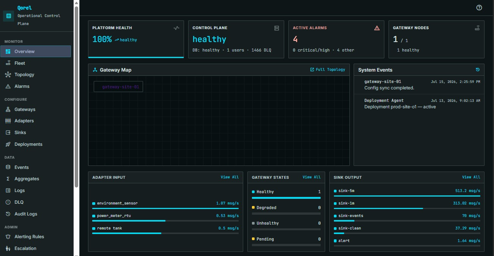
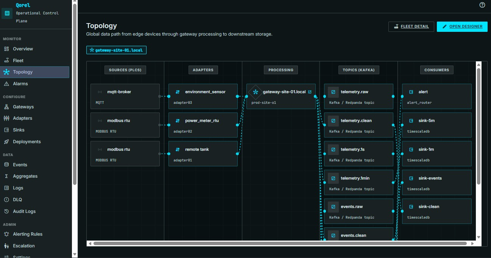
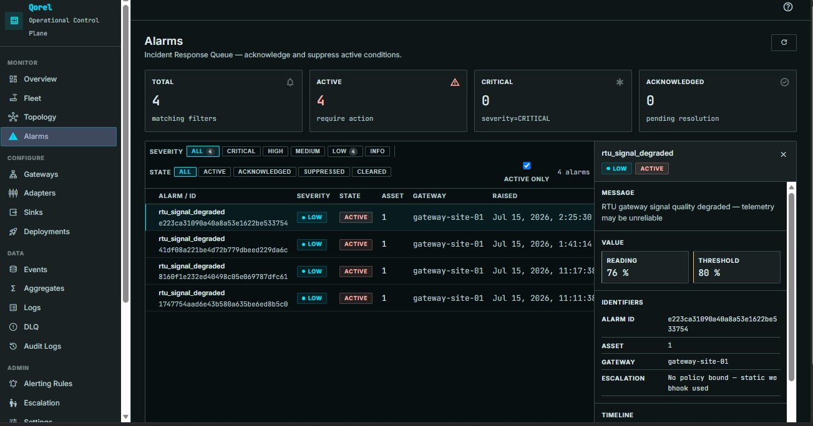
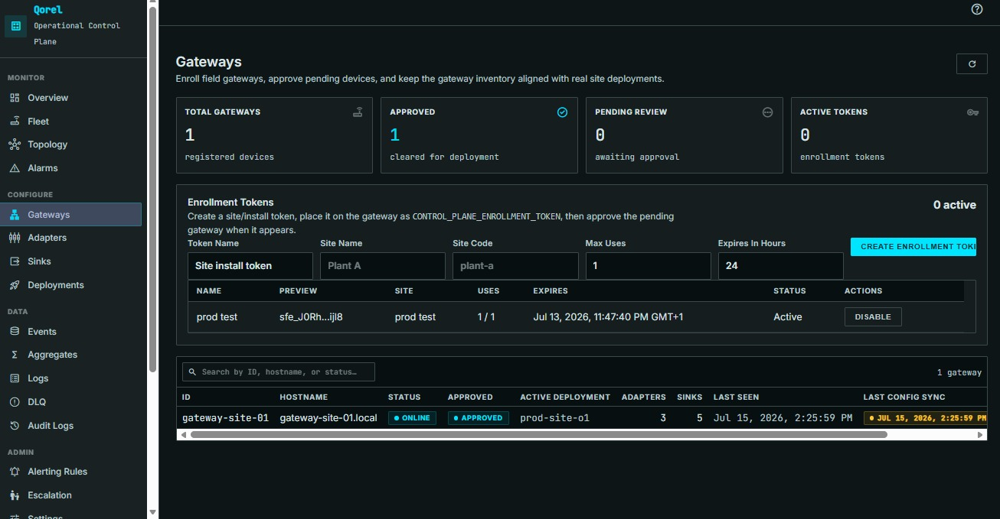
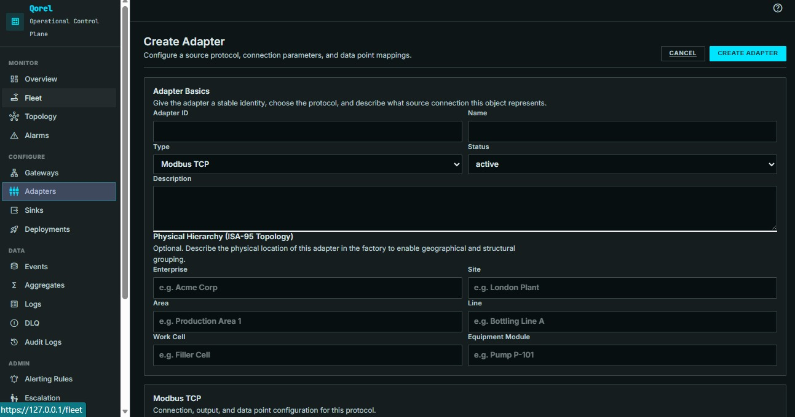
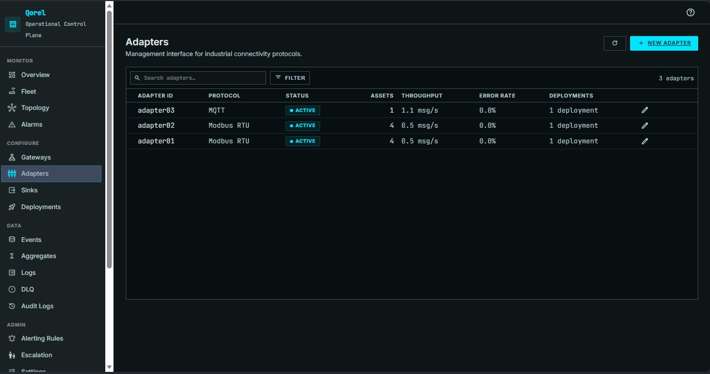
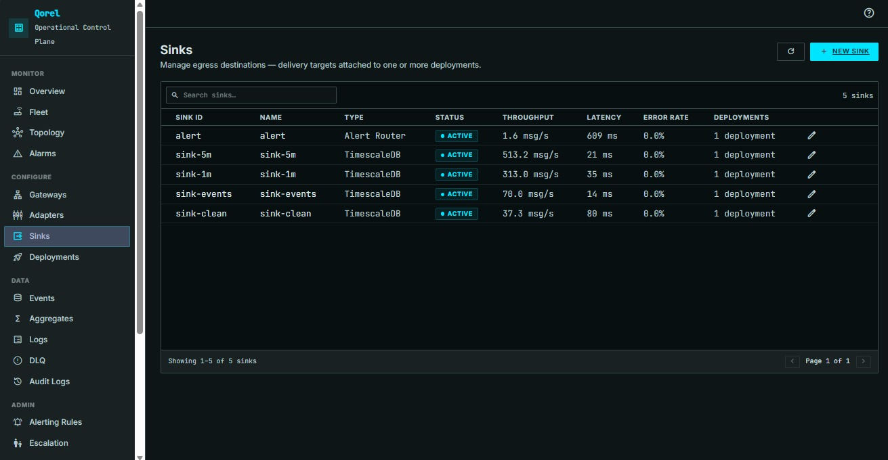
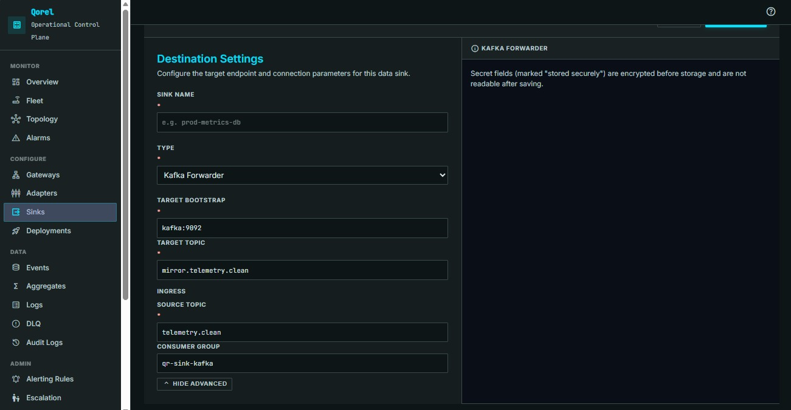
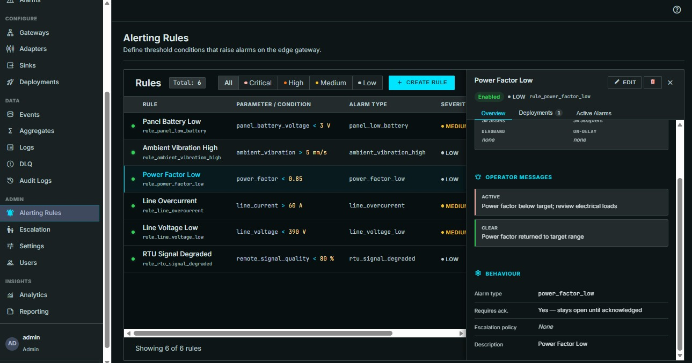

# Qorel

Qorel is an in-progress industrial data platform for moving OT data into
modern data systems without treating the edge as an afterthought.

> This is a public showcase repo. The full codebase is private while the
> project is under active development. This repo exists to share progress,
> screenshots, and design decisions.

It is designed around a simple idea: every gateway should be able to collect
industrial signals, write them to a durable local stream backbone, keep running
through network and sink outages, and expose enough control-plane visibility for
operators and data teams to understand what is happening.

## Why I Built This

I studied electrical and electronics engineering, and my interests sit where
industrial automation, robotics, digital twins, data engineering, and AI meet.
In industrial environments, the OT/IT gap is hard to miss: PLCs, SCADA systems,
sensors, and machines produce valuable signals, but getting those signals into
reliable, replayable, AI-ready pipelines is still harder than it should be.

Qorel is my attempt to bridge that gap architecturally. It treats
industrial data as something that must survive bad networks, sink failures,
offline periods, changing downstream systems, and operator handoffs while still
remaining understandable to people working close to the equipment.

## Screenshots

**Overview**, platform health, control-plane status, active alarms, and live adapter/gateway/sink throughput.

**Topology**, the lane-based dataflow view, from PLCs through adapters and gateway processing to Kafka-compatible topics and consumers.

**Alarms**, the incident response queue, with severity/state filtering and a detail drawer for value, threshold, and escalation status.

**Gateways**, enrollment token issuance and the gateway inventory (status, approval, active deployment, adapters/sinks, last seen).

**Adapters**, protocol-aware configuration, including ISA-95 physical hierarchy tagging.

**Sinks**, egress destinations with live throughput, latency, and error rate.

**Alerting Rules**, threshold-based rules with operator messages and escalation behavior.

## Architecture At A Glance

Qorel is split into a control plane and a data plane.

**Control Plane**
- FastAPI service for configuration, auth, RBAC, audit, gateway state, and
  operator workflows
- PostgreSQL-backed configuration and audit state
- React/TypeScript UI for operators and engineers
- Catalog-driven configuration contracts for adapters and sinks

**Data Plane**
- Gateway runtime that runs at the edge
- Containerized protocol adapters for industrial sources
- Local Kafka-compatible stream backbone (Redpanda-backed in the local
  dev/runtime stack)
- Validator, event validator, aggregator, overflow controller, and managed sink
  processes
- Sink services that write to databases, HTTP endpoints, alert destinations, or
  customer-owned Kafka-compatible systems

The browser UI talks to the central control plane. Remote gateways call out to
the control plane for configuration and heartbeat updates. The frontend does not
need direct network access to gateways in different physical locations.

## Core Principles

**1. The Edge Stream Is The Local Source Of Truth**
Industrial data should land first in a durable local stream on the gateway.
Everything downstream should be replaceable and replayable.

**2. Control Plane And Data Plane Stay Separate**
The control plane defines what should run. The gateway runtime makes it happen
locally. If the control plane is unavailable, gateways should keep running from
their last known good configuration.

**3. Industrial Data Needs Semantics**
Qorel separates data into telemetry (continuous measurements), events (discrete
state changes), alarms (lifecycle-aware abnormal conditions), and logs
(operational/runtime messages), instead of one undifferentiated stream of
industrial noise.

**4. Operator Trust Matters**
Configuration should be testable before deployment. Runtime state should be
visible without shell access. Failures should degrade clearly instead of
failing silently.

## Current Status

Qorel is not a finished production product yet. It is a serious engineering
project with a working core and an honest production-readiness queue.

Implemented today:

- reusable adapter, sink, and deployment objects
- protocol-aware forms for Modbus TCP, Modbus RTU, MQTT, and OPC UA
- TimescaleDB, Kafka-compatible, HTTP, and alert-routing sink paths
- gateway runtime with local stream processing, validation, aggregation, logs,
  health, and overflow controls
- control-plane APIs for configuration, auth, RBAC, audit, alarms, DLQ, events,
  aggregates, fleet, logs, alerting rules, escalation policies, and operator checks
- React operator UI for adapters, sinks, deployments, validation/test/preflight,
  events, aggregates, fleet, logs, alarms, DLQ, alerting rules, escalation
  policies, health, and users
- gateway enrollment with Ed25519 device identity and proof-of-possession,
  operator approval, and revoke / restore / re-key
- an always-on edge historian that backs operator history independently of any
  sink
- gateway-executed connection tests dispatched from the control plane

Still in progress:

- registry-publish and Kubernetes image-pull-secret templates
- fresh-stack and failure-path verification gates before AI work begins
- responsive and readability hardening across the operator UI

## Comparison

| Area | Qorel | SCADA/Ignition | Cloud IoT Platforms | Custom Scripts |
|------|-------------|----------------|---------------------|----------------|
| OT protocol focus | Native adapter model | Strong, often plugin-based | Limited or gateway-dependent | Manual |
| Edge autonomy | Core design goal | Varies by deployment | Often cloud-centered | Fragile |
| Local replay buffer | Built around a Kafka-compatible edge stream | Usually database/historian-centered | Cloud queue dependent | Usually absent |
| Data engineering fit | Stream-native, replayable, sink-oriented | Possible but indirect | Strong in-cloud, weaker offline | Ad hoc |
| Operator visibility | Control-plane UI and runtime health surfaces | Strong HMI/SCADA visibility | Cloud dashboards | Minimal |
| Vendor neutrality | Designed for on-prem and hybrid use | Often proprietary | Cloud lock-in risk | Depends on author |

## Roadmap

**Completed core scope:** architecture baseline, control-plane API baseline,
gateway runtime baseline, Redpanda-backed local dev/runtime broker path,
reusable adapters/sinks/deployments, validation and preflight flows, events,
aggregates, fleet, logs, alarms, DLQ, alerting rules and escalation policies,
RBAC, audit trail, gateway enrollment/approval/revocation, edge historian,
topology view, production compose packaging.

**Active production-readiness work:** registry-publish and Kubernetes
image-pull-secret templates, self-healing verification against a live stack,
responsive/readability hardening, fresh-stack and failure-path verification
gates.

**Later:** additional industrial adapters and sink destinations, deeper
production observability, optional enterprise auth UX, AI/copilot features
once the core platform is trustworthy enough to support them.

## Documentation

- [Technical Walkthrough](docs/QOREL_TECHNICAL_OVERVIEW.md), a concrete walk
  through a deployment, the engineering underneath it, protocol depth, the
  operator experience, and what's shipped today
- [Architecture](docs/ARCHITECTURE.md)
- [Data Flow](docs/DATA_FLOW.md)
- [Security](docs/SECURITY.md)
- [Architecture Decision Records](docs/adr/), 15 ADRs covering edge
  buffering, protocol adapters, schema management, validation/DLQ, sinks,
  gateway autonomy, authentication, failure modes, overflow handling, the
  copilot/MCP direction, alerting rules, escalation policies, alarm
  lifecycle, and historian placement

## License

Licensing for the eventual public release is still being finalized.

## Contact

This project is currently owner-led while the core architecture and production
readiness work settle. Technical feedback and questions are welcome via GitHub
issues on this repo.
